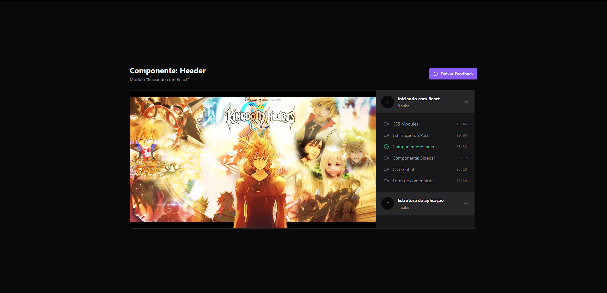

# Video Player - Watch your classes without any complications 📚

<br>

<p align="center">
  <a href="#-about-the-project">About the project</a> •
  <a href="#-technologies">Technologies</a> •
  <a href="#-getting-started">Getting started</a> •
  <a href="#-license">License</a>
</p>

<p align="center">
 
 
  
</p>

## 👩‍💻 About the project

This project is an interactive video player designed to allow users to easily access available modules and classes and watch videos of their classes in an intuitive way. The main objective of this project is to explore and compare the use of the Redux and Zustand libraries, two powerful tools for state management in JavaScript applications.

By implementing the same features using both libraries, this project offers a comparative analysis of their differences and benefits, allowing developers to better understand how each of them can be applied in different scenarios. The project also includes unit tests to ensure code quality and stability.

## 🚀 Technologies

- [Tailwind](https://tailwindcss.com/)
- [Radix UI](https://www.radix-ui.com/)
- [React-player](https://www.npmjs.com/package/react-player)
- [Redux](https://redux.js.org/)
- [Zustand](https://github.com/pmndrs/zustand)

## 💻 Getting started

### Requirements

- [Node.js](https://nodejs.org/en/)
- [Yarn](https://classic.yarnpkg.com/) or [NPM](https://www.npmjs.com/) _(examples are with NPM)_

**Clone the project and access the folder**

```bash
$ git clone https://github.com/leandrorodrigues00/react-redux-zustand && cd react-redux-zustand

```

**Follow the steps below**

```bash
# Install the dependencies
$ npm i

# Start the server
$ npm run server

# Start the app
$ npm run dev

# run the tests
$ npm run test
```

## 📝 License

This project is licensed under the MIT License - see the [LICENSE](LICENSE) file for details.

---

<p align="center">
  Made with 💜&nbsp; by  Leandro Rodrigues
</p>
